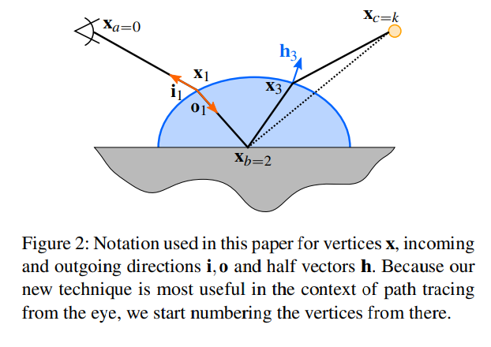

# 1 Introduction

光輸送をシミュレーションすることは科学の様々な分野からCG産業に至るまで多くの応用があります。近年では、映像産業はモンテカルロパストレーシングに大きな注目を示しています。パストレーシングは商業的なレンダラー（ソリッドアングル社のArnoldやピクサーのRenderMan）や社内開発のレンダラー（ディズニーのHyperionやワタデジタルのManuka)の両方で数多くの発展を及ぼしています。

静止画を使用することが多い建築や製造産業とは対照的に、映像業界での産業レンダラーは主にアニメーションの制作に使用されます。これは各フレームのレンダリングに費やされる時間の量に厳しい制約が課せられます。多くのプロダクションでは、これはレンダラーが一般的に一夜でレンダリングし、シャープかつ低ノイズな画像を時間的な安定性を持ったうえで出さなくてはなりません。映画（特にVFX)で使用されている一般的なビジュアル言語はレイトレーシングする際に非常に高価になる複雑で膨大なアセットに変換されます。この理由から、サンプルの配置（レイトレのサンプルのこと？）を工夫することは大きな利点を生みます。

アンバイアスなパストレーシングをサンプルするのに特に困難な１つのパスの制約はspecular-diffuse-specula(SDS)と呼ばれる（特にちゃんとサンプルするのが難しいもの）。２つのスペキュラ点の間にDiffuseまたは粗いグロッシーな点を含む光輸送パスが存在しているとする。
この制約はスペキュラーイベントが満たすのが難しいハーフベクターの制約を課すため問題となります。
サンプリングする際、これは中間点($x_b$)でのディフューズ散乱のシミュレーションが光源へ$x_b$からパスを直接つなぐことができないことを意味します。
確かに、この場合、一般的なアプローチとして光源点決定的につなぐ違うサンプリング手法（NEE）が使われます。$x_b$から光源に行く全てのパスは屈折面を通らないといけないため、この手法は使うことができないことが分かります。

Metropolis light transport(MLT)やフォトンマッピングといったSDSパスをうまく扱おうとする手法はありましたが、これらは時間的な安定性やメモリフットプリントが大きいという欠点があり、実用的な手法ではありませんでした。これは肌についた水滴や水、またはガラス、水に埋め込まれたオブジェクトといった一見簡単に見えるケースでも不十分でした。
許容ライトパス（admissible light path)は通常、界面を無視した非屈折接続からそこまで大きくは逸脱しません。
NEEが提案するパスでありますが、これはフェルマーの法則（最短距離を通る）に違反するため失敗します。
(フェルマーの法則)[https://ja.wikipedia.org/wiki/%E3%83%95%E3%82%A7%E3%83%AB%E3%83%9E%E3%83%BC%E3%81%AE%E5%8E%9F%E7%90%86]

我々の発想はNEEをより"堅牢"にする、つまり接続をあきらめることなく寄与を取れるように種パスをハーフベクトル制約を満たす許容パスに変更することを目的にしている。
我々はこれを相関サンプリング、すなわち、ランダムに種パスをマルコフ連鎖モンテカルロ法から外れることなく摂動させることで実現しました。
これにより、実装や既存システムの組み込みが用意になることが考えられ、フレーム感のノイズも改善する。
この手法は粗い散乱や多層透明面への理想スペキュラにのみ対応しています。
これをバイアスを入れずにNEEに拡張し、モンテカルロパストレイサーに統合します。
この手法は実用的には非常によくある、関係しているシンプルなシーンの範囲で効果的であり、スレッド同期が必要ないため、うまく少ないメモリ要求と拡張性をつなげている。

# 2 Background and previous work

光輸送シミュレーションの目的は放射輸送方程式(レンダリング方程式)を解くことにあります。CGのコンテキストにおいては、これがレンダリング方程式として定式化されており、一般にランダムウォークを基にするモンテカルロ法であるレイトレーシングを使うことで解いている。
このアルゴリズムの基礎はアイと光源を接続するシーンのライトのパスで構成されています。

### Path space
全ての光輸送パスの空間をPath Spaceと呼び、ここでは$\Omega$と表記します。我々は$\Omega$内の１つのパスを点のリスト$\bf{x_i}$と表現し、$\bf{X_{a,b}} = \bf{(x_a,x_{a+1},...,x_b)}$という形でサブパスを省略します。
似たように頂点$i$のハーフベクトルを$\bf{h_i}$と表し、同様にハーフベクトルのリストを$\bf{H_{a,b}} = (\bf{h_a},\bf{h_{a+1}},...,\bf{h_b})$と省略します。そしてアイからの入射ベクトルを$\bf{i_i}$,ライト方向への出射ベクトルを$\bf{o_i}$とします。
測度は面積測度として$d\bf{x}$と表し、立体角を$d\bf{o}$,投影立体角（コサイン項を含めた立体角）は$d\bf{o^{\perp}}$と表す。
そして、ハーフベクターの領域は$d\bf{h}$として置きます。これは基本的に投影立体角として扱います。

パスはk+1の頂点をもち、アイの$x_{a=0}$からパスが伸びており、$x_{b}$はNEEによって呼び出され、$x_{c=k}$にて光源上の点として到着する。

直感的に、光輸送シミュレーションの目的はピクセルjに到達する放射束を求めることになります。定式的に以下のように表せます。

$$I_j = \int_{\Omega} f(\bf{X}) d\bf{X} \tag{1}$$

ここで$d\bf{X} = \prod_{i = 0}^{k} dx_i$であり、全ての頂点パスの面積測度をまとめて書いた形である。パスの長さは$k \in [1,\infty)$である。

測度寄与関数（measurement contribution function）$f(\bf{X})$ は直感的にどれだけ多くのフォトンが単位時間で異なる頂点のエリアを経由して運ばれるのかを計算します。
これは簡単にするため投影立体角の測度$d\bf{O^{\perp}} = d\bf{x_0} \prod_{i = 0}^{k-1} d\bf{o_i^{\perp}}$
で考えると以下のように表すことができます

$$f_{d\bf O^{\perp}}(X) = W(\bf{x_0}) L_e(\bf{x_k}) \prod_{i = 1}^{k-1} f_r(\bf{i_i,x_i,o_i}) \tag{2} $$

$f_r$はBSDFであり、$W_(\bf{x})$はアイレスポンシビティ（多分カメラウェイト）、$L_e(\bf{x_k})$は光源からの輝度である。（ここでは光源に当ったらそこで終了するものとして論議してるっぽい）
幾何項は投影立体角から面積測度へ変換する際のやこびあんである。当論文ではボリュームは考慮しない。

### Determistic connection
NEEまたはライティングを直接計算することは輸送パスを構築する決定的な接続をするには最もシンプルながら重要な方法あり、その最適化に多くの思考が費やされてきました。

Bidirectional path tracingは光源のパスの最後の頂点だけではなく、独立するランダムウォークの頂点２つをどれか選び、接続します。これの結果は推定量が多くなり、multiple importance samplingを用いることでウェイトを調節することが必要となります。
しかしながら、両方向手法でさえ、屈折面がかかわるSDSパスをつなぐことはできません。

### Photon mapping
この問題を扱える可能な手法として、積分を強制的に滑らかにする標準化(Regularisation)を使用することです。標準化は